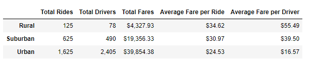
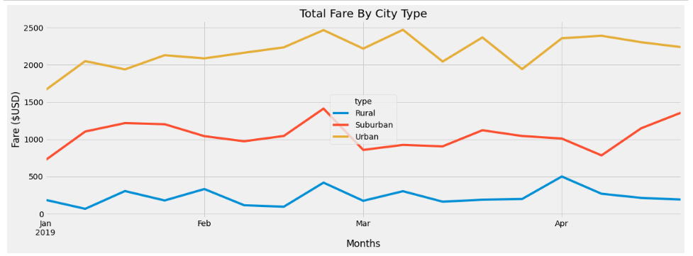

# PyBer_Analysis

## Challenge Overview
### Overview of the PyBer Analysis
 The purpose of this analysis was to analyze ride share data by city to discover trends by city "type" (Rural, Urban, and Suburban). Pandas and Matplotlib were used to create a visual of the data analysis.

## Resources
Data Sources: 
- city_data.csv
- ride_data.csv

## Results

- Almost 70% of the total rides analyzed were Urban rides, with 25% being Suburban and 5% Rural

- Almost 80% of the total drivers are Urban, with 16% being Suburban and only 2% of drivers were Rural

- The average fare per ride is highest in Rural settings, most likely due to length of ride (we would expect Urban rides to typically be shorter than Rural rides due to distance).

- Average fare per driver more than doubles when shifting from driving in Urban vs Suburban settings, and increases by 1.5x when comparing Suburban vs Rural settings.

- The total fare for Urban rides is pretty flat from Jan through Apr.

- The fares for Suburban and Rural rides are a bit more volatile, as seen by the larger spikes and dips in the chart.

## Summary

- If PyBer wanted to attract more drivers overall, they could use this data to show that drivers are more scarce in Rural settings, and the average fare per driver is much higher compared to Suburban or Urban settings.

- PyBer could add in more time series data to show the trends through the remainder of the year, to see if any seasonality in fare prices occurs based on city type.

- There is work PyBer could do revolving around the higher proportion of Urban drivers vs rides.  Incentivizing customers to use PyBer vs another ride sharing company could help with the disparity in increasing the overall number of Urban rides.